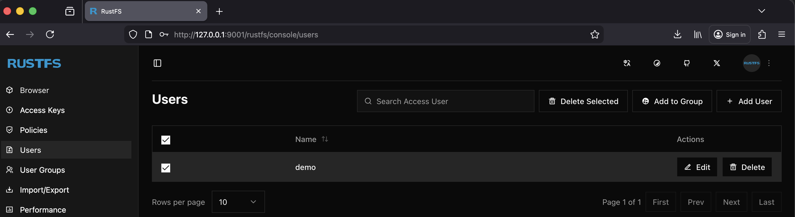
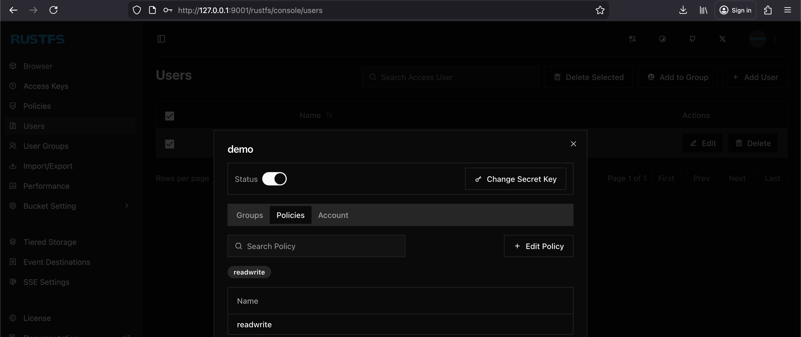

# Doc-Store

## Introduction

This is a minimalistic POC, based on Axum and RustFS (compatible with Minio/AWS S3).

The API Entry Points:

* /bucket/create: create a bucket
* /bucket/delete: delete a bucket
* /bucket/list: list the files in the bucket

* /file/upload: upload a file in a bucket
* /file/download: download a file from a bucket
* /file/delete: delete a file in a bucket

The Repos contains a docker-compose.yaml file configuring a local instance of RustFS (https://rustfs.com/).

When the Docker instance is started, you can access the web console can be opened by the link http://localhost:9001/ 

The defined user / password from the docker-compose.yaml (rustfsadmin/rustfsadmin). 

You can create optionally, when you like, a new application user by the web interface and apply the credentials in the
tools/s3.rs

```rust
        Config {
            // rustfsadmin
            region: "eu-west-1".to_string(),
            access_key_id: "demo".to_string(),
            secret_access_key: "demodemo".to_string(),
            endpoint_url: "http://localhost:9000".to_string(),
        }
```

Web Interface (http://localhost:9001/):





and attach the policies: [readwrite]

## Demo

Starting the application doc-store. The application can be accessed on the port 3000.

In the folder /curl are some basic JetBrains http instructions for execution, or the curls: 

Create a Bucket

```shell
curl -X PUT --location "http://localhost:3000/bucket/test-bucket"
```

List the content of a Bucket

```shell
curl -X GET --location "http://localhost:3000/bucket/test-bucket"
```

Delete a Bucket

```shell
curl -X DELETE --location "http://localhost:3000/bucket/test-bucket"
```

Upload a file to a Bucket

```shell
curl -X POST --location "http://localhost:3000/file/test-bucket/hello.txt" \
    -F "file=@./curl/hello.txt;filename=hello.txt;type=text/plain"
```

Download a file from a Bucket

```shell
curl -X GET --location "http://localhost:3000/file/test-bucket/hello.txt"
```

Delete a file from a Bucket

```shell
curl -X DELETE --location "http://localhost:3000/file/test-bucket/hello.txt"
```

Bonus:

If you are a friend of TUI, https://github.com/oxide-byte/s3tui-fork/tree/feature/endpoint_url is
a fork of https://github.com/softberries/s3tui for using a TUI interface with a local configuration.

```shell
export S3TUI_DATA=/Users/qdart/rust/doc-store/s3tui/.data
export S3TUI_LOGLEVEL=info
s3tui
```